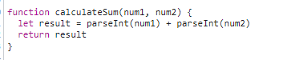

1. Two strings were entered into calculateSum(), instead of two integers. Thus, the `+` operation would concatenate thet wo strings together instead of adding them like numbers. 
2. I would fix it by casting each input to calculateSum to an int and then adding them. 